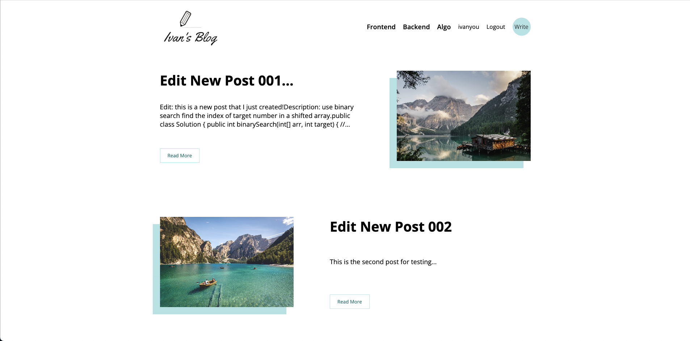
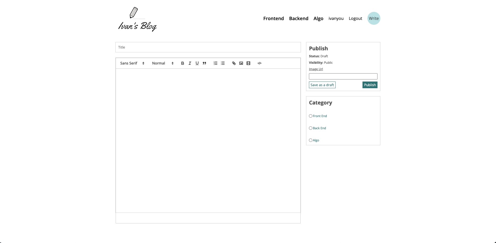
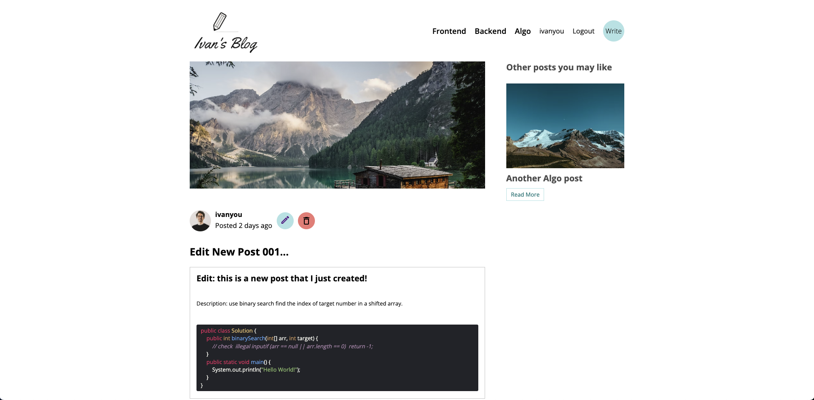
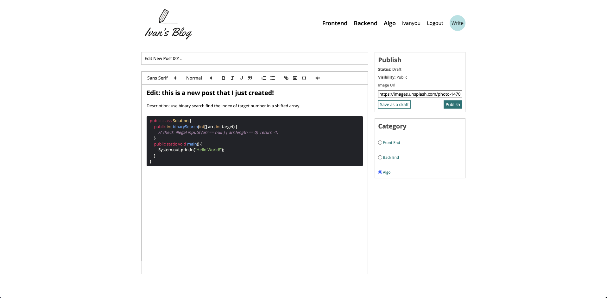

## My Personal Blog

    This is the repository of my personal blog (frontend).

### Reference:
<Link>https://www.youtube.com/watch?v=0aPLk2e2Z3g&ab_channel=LamaDev</Link> 
<Link>https://www.youtube.com/watch?v=mbsmsi7l3r4&ab_channel=WebDevSimplified</Link>

### Website Url: 
<a>https://spontaneous-pithivier-8ca30f.netlify.app/</a>

### Tech Stack:
<ul>
    <li>Frontend</li>
    <ul>
    <li>React.js</li>
    <li>Sass</li>
    </ul>
    <li>Backend</li>
    <ul>
    <li>Express.js</li>
    <li>MySQL</li>
    <li>JWT</li>
    </ul>
</ul>

### Homepage:

### Create a post:

### View a post:

### Edit a post:
